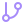

 

---

##  Sobre mim

Formado em **Desenvolvimento de Sistemas** pela **SESI/SENAI**. Trabalho em aplicações web completas: front-end em React com TypeScript, API em Python com FastAPI, tudo orquestrado em Docker e publicado em VPS Linux.

- Projeto atual: plataforma multi-tenant de ofertas — coleta de produtos, painel administrativo e publicação automática em WhatsApp e Telegram
- Foco em back-end, banco de dados e automação de processos
- Contato: **almeida091123@gmail.com**

---

##  Tecnologias

**Linguagens**

**Front-end**

**Back-end**

**Dados**

**Infra e automação**

---

##  Estatísticas

  

  

---

##  Contribuições

---

